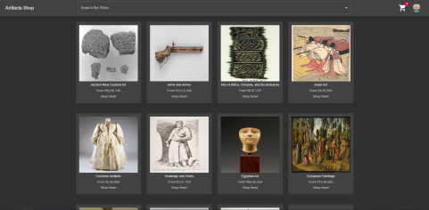
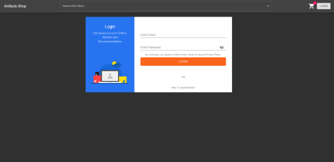
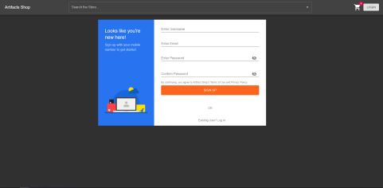

# Getting Started with this project

## About this project

This is a **`MERN stack`** **E-Commerce** artifacts website purpose of the project is to build a platform for Artists who
are great at their work and wish not to limit their talent and
also scale their talent. \
Also for the art lovers who do not wish to leave theirr town
but love to buy beautiful artifacts, **Artifacts Shop** will be a
platform for them to do so.

---

## Prerequisite

You need to have [**node**](https://nodejs.org/en/) as well as [**npm**](https://nodejs.org/en/) installed on your machine

---

## Client side project setup

### Steps to successfully run this project

-   Change your working directory using this command

    #### `cd client`

-   Then install all the depenedencies using

    #### `npm install`

-   The project is ready to be run in a development mode using

    #### `npm start`

    Runs the app in the development mode.\
     Open [http://localhost:3000/](http://localhost:3000/) to view it in the browser.

    The page will reload if you make edits.\
     You will also see any lint errors in the console.

-   You can test your application using the

    #### `npm test`

    Launches the test runner in the interactive watch mode.\
     See the section about [running tests](https://facebook.github.io/create-react-app/docs/running-tests) for more information.

-   After making the required changes the production build of the project can be build using

    #### `npm run build`

    Builds the app for production to the `build` folder.\
     It correctly bundles React in production mode and optimizes the build for the best performance.

    The build is minified and the filenames include the hashes.\
     Your app is ready to be deployed!

    See the section about [deployment](https://facebook.github.io/create-react-app/docs/deployment) for more information.

### Environment Variables

-   Create a `.env` file in the root directory of the client folder

-   Create the environment variables **`REACT_APP_JWT_SECRET`** and **`REACT_APP_STRIPE_PUBLIC_KEY`**

    **`REACT_APP_JWT_SECRET`** - is an alphanumeric string used to make a secret key to authenticate the user and automatically log in the user

    **`REACT_APP_STRIPE_PUBLIC_KEY`** - can be found in the [**Stripe**](https://stripe.com/en-in) account

### Project folders

-   **`client/public`** - contains the static files like `index.html`, `favicon.ico`(page icon) and `sold_out.png` image

-   **`client/src`**
    -   **`src/assets`** - contains all the assets that is used for the creation of the website
    -   **`src/components`**
        -   **`components/Cards`** - contains the `.js` file to show the artifcats in a **Card** format
        -   **`components/Cart`** - contains the `.js` file to show the users **Cart**
        -   **`components/Checkout`** - contains the `.js` file to show the artiacts that are to be checked out
        -   **`components/DepartmentWise`** - contains the `.js` file to show the artifacts acording to their **Department**
        -   **`components/LandingPage`** - contains the `.js` file which the user will see when they first visit the website
        -   **`components/Loading`** - contains the `.js` file to
            show the **Loader** whenever the client tries to fetch data from the server
        -   **`components/LoginSignUp`** - contains the `.js` file to propt the user to **LogIn** or **SignUp** if not already done
        -   **`components/ProductPage`** - contains the `.js` file to show all the details of the product as well as the `Add to Cart` and `Buy Now` options.
        -   **`components/Profile`** - contains the `.js` file to show the **user profile** and the **order details**
    -   **`App.js`** - contains the entry `.js` file where all the other components reside
    -   **`index.js`** - the main `.js` file
    -   **`PrivateRoute.js`** - defines all the private routes that only the **Logged In** user can access

```
client/
├── [4.0K]  build
│   ├── [1.1K]  asset-manifest.json
│   ├── [ 32K]  favicon.ico
│   ├── [2.1K]  index.html
│   ├── [361K]  sold_out.png
│   └── [4.0K]  static
│       ├── [4.0K]  css
│       │   ├── [4.6K]  2.81dde01e.chunk.css
│       │   └── [7.1K]  2.81dde01e.chunk.css.map       
│       ├── [4.0K]  js
│       │   ├── [1.5M]  2.61e82582.chunk.js
│       │   ├── [4.0K]  2.61e82582.chunk.js.LICENSE.txt
│       │   ├── [5.5M]  2.61e82582.chunk.js.map        
│       │   ├── [ 67K]  main.076ddfee.chunk.js
│       │   ├── [173K]  main.076ddfee.chunk.js.map     
│       │   ├── [1.5K]  runtime-main.a9f80a17.js       
│       │   └── [8.1K]  runtime-main.a9f80a17.js.map   
│       └── [4.0K]  media
│           ├── [ 12K]  emptyCart.b5fe7e5c.png
│           ├── [ 12K]  revicons.57fd05d4.ttf
│           ├── [ 12K]  revicons.a77de540.eot
│           ├── [7.4K]  revicons.e8746a62.woff
│           └── [361K]  sold_out.74289aa2.png
├── [1.6M]  package-lock.json
├── [2.0K]  package.json
├── [4.0K]  public
│   ├── [ 32K]  favicon.ico
│   ├── [ 498]  index.html
│   └── [361K]  sold_out.png
└── [4.0K]  src
    ├── [4.8K]  App.js
    ├── [ 412]  PrivateRoute.js
    ├── [ 838]  Test.js
    ├── [4.0K]  assets
    │   ├── [203K]  Data.json
    │   ├── [ 12K]  emptyCart.png
    │   ├── [361K]  sold_out.png
    │   └── [5.3K]  testData.json
    ├── [4.0K]  components
    │   ├── [4.0K]  Cards
    │   │   ├── [2.5K]  ArtifactsCard.js
    │   │   └── [1.9K]  ArtifactsCards.js
    │   ├── [4.0K]  Cart
    │   │   └── [ 14K]  Cart.js
    │   ├── [4.0K]  Checkout
    │   │   ├── [8.3K]  Address.js
    │   │   ├── [1.8K]  Checkout.js
    │   │   ├── [ 754]  CustomText.js
    │   │   ├── [4.0K]  Payment.js
    │   │   ├── [1.5K]  ReviewOrder.js
    │   │   └── [2.8K]  SavedAddress.js
    │   ├── [4.0K]  DepartmentWise
    │   │   └── [1.1K]  DepartmentWiseProducts.js
    │   ├── [4.0K]  Header.js
    │   ├── [4.0K]  LandingPage
    │   │   ├── [1.8K]  LandingCards.js
    │   │   ├── [2.5K]  LandingPage.js
    │   │   └── [ 899]  LandingPage.loading.js
    │   ├── [4.0K]  Loading
    │   │   └── [1.1K]  Loading.js
    │   ├── [4.0K]  LoginSignUp
    │   │   ├── [1.0K]  Auth.styles.js
    │   │   ├── [5.6K]  LoginScreen.js
    │   │   └── [7.8K]  SignupScreen.js
    │   ├── [4.0K]  ProductPage
    │   │   ├── [3.1K]  BottomCards.js
    │   │   ├── [2.0K]  ProductPage.js
    │   │   ├── [6.8K]  ProductPage.loading.js
    │   │   └── [ 12K]  TopCard.js
    │   └── [4.0K]  Profile
    │       ├── [6.6K]  IndividualOrder.js
    │       ├── [6.8K]  Orders.js
    │       └── [5.2K]  Profile.js
    └── [ 146]  index.js
```

---

## Server side project setup

### Steps to successfully run this project

-   Change your working directory using this command

    #### `cd server`

-   Then install all the depenedencies using

    #### `npm install`

-   To start a development server use

    #### `npm run dev`

    Changes made to the **server** folder will be automatically reflected using this command

-   To start a production server use

    #### `npm start`

### Environment Variables

-   Create a `.env` file in the root directory of the server folder

-   Create the environment variables **`MONGODB_URI`**, **`JWT_SECRET`** and **`JWT_EXPIRE`**

    **`MONGODB_URI`** - contains the database URI used to connect server to the [**MongoDB**](https://www.mongodb.com/) database

    **`JWT_SECRET`** - is an alphanumeric string used to make a secret key to authenticate the user and automatically log in the user

    **`JWT_EXPIRE`** - creates a session for automatic user log in without reentering the user credentials.

### Project folders

-   **`server/config`** - contains the `.js` file to connect the server to the **MongoDB atlas**
-   **`server/controllers`** - the defination of what all the **API** endpoint will achieve
-   **`server/middleware`** - contains all the middleware forthe **API** endpoint
-   **`server/models`** - contains the database models
-   **`server/routes`** - all the **API** endpoints which the client can hit
-   **`server/utils`** - contains the utility `.js` files for ease of project building

```
server/
├── [  19]  Procfile
├── [4.0K]  config
│   └── [ 516]  database.js
├── [4.0K]  controllers
│   ├── [2.1K]  cartController.js
│   ├── [1.8K]  orderController.js
│   ├── [3.4K]  productsController.js
│   ├── [2.0K]  userController.js
│   └── [1.4K]  userPurchaseInfoController.js
├── [4.0K]  middleware
│   ├── [ 847]  auth.js
│   └── [ 649]  error.js
├── [4.0K]  models
│   ├── [ 576]  Artifacts.model.js
│   ├── [ 288]  Cart.model.js
│   ├── [ 494]  Order.model.js
│   ├── [1.6K]  User.model.js
│   └── [ 306]  UserPurchaseInfo.model.js
├── [166K]  package-lock.json
├── [ 710]  package.json
├── [4.0K]  routes
│   ├── [ 441]  Cart.js
│   ├── [ 482]  Order.js
│   ├── [ 717]  Products.js
│   ├── [ 517]  User.js
│   └── [ 412]  UserPurchaseInfo.js
├── [ 860]  server.js
└── [4.0K]  utils
    ├── [ 178]  errorResponse.js
    └── [ 667]  sendEmail.js
```

---

## Some of the UI images

\
Home Page

\
Login Page

\
Sign up Page

#### Other Images will be found [**here**](images)

---
